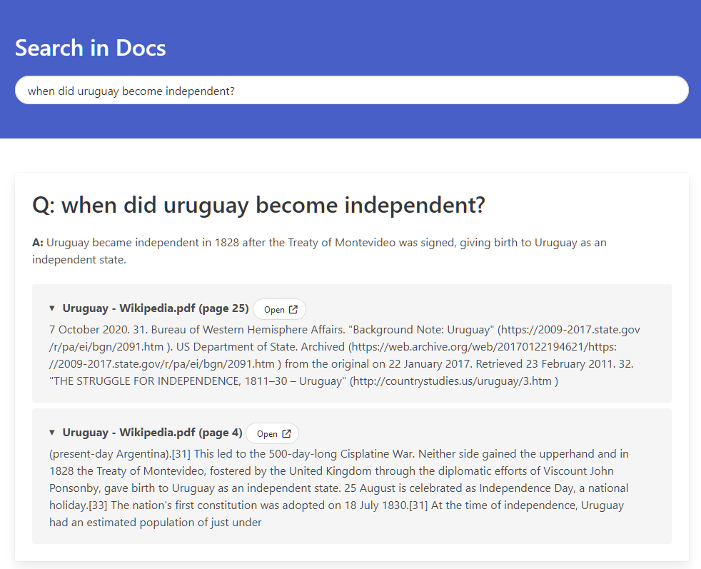

# Search in Docs

`Search in Docs` is a Web-Based interface to search local documents for answers using [Llama 2](https://ai.meta.com/llama/) or other models supported by langchain. It can run on the CPU, GPU or mixed.

Based on [Llama-2-Open-Source-LLM-CPU-Inference](https://github.com/kennethleungty/Llama-2-Open-Source-LLM-CPU-Inference) and [this article](https://towardsdatascience.com/running-llama-2-on-cpu-inference-for-document-q-a-3d636037a3d8).

The updates on this repo are:
- New Web UI that allows you to search endlessly for documents, without having to re-load the entire model every time.
- Ability to expand the references and go to the source file at the specific page (works with PDFs by attaching `#page=<page>`).

## Steps

1. Install the required packages (`pip install -r requirements.txt`). If you want to use CUDA (GPUs), make sure to install Pytorch with CUDA.
2. The `data` directory needs to hold all the files used for indexing and searching. Replace the file `Uruguay - Wikipedia.pdf` with your `.txt` or `.pdf` files.
3. Download the LLM into `models/`. The orginal repo suggests downloading them from [this huggingface](https://huggingface.co/TheBloke/Llama-2-7B-Chat-GGML) to run the models on the CPU. If you don't know which one to use, start with [this one](https://huggingface.co/TheBloke/Llama-2-7B-Chat-GGML/blob/main/llama-2-7b-chat.ggmlv3.q2_K.bin) that worked for me.
4. Tweak a few parameters on [`config.yml`](config/config.yml):
    - `MODEL_BIN_PATH`: The path to the model.
    - `DEVICE`: If you want to use the GPU, set to `cuda`, otherwise use `cpu`.
    - `GPU_LAYERS`: Try a few different values (higher is better). Depending on the VRAM of the GPU you may be able to fit more layers in the GPU. If your GPU runs out of VRAM, the setup will fail with an error, and you can lower the number. My setup has a `3060Ti`` and runs 30 layers correctly.
    - `MODEL_TYPE`: If running a non-llama model, change the name here.
5. Generate your indexed database of the documents. Run `python db_build.py`.
6. Run the command line mode with `python endless.py` or the web UI with `flask run`.
    - If using the web UI, go to [localhost:5000](http://localhost:5000).

> Note: Attempt first to run the command line app to test the initial setup. Once the command line works (the model loads properly in the GPU), you can try the Web UI.

## References

Read more at the [original repo](https://github.com/kennethleungty/Llama-2-Open-Source-LLM-CPU-Inference) that contains the single-use commandline interface.
